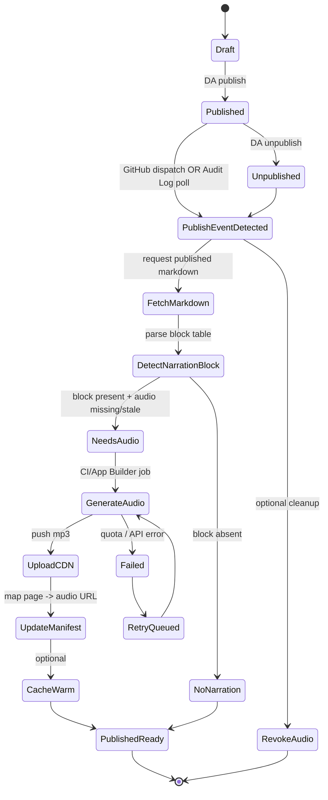

# Narration Block Ideation Journey

## Purpose
Capture the design and operational options for the **Narration** block in Oak Chain EDS, including publish-triggered audio generation and edge/CDN delivery.

## Core Constraints
- **No on-demand TTS** in live traffic. Audio must be pre-generated and served from CDN/edge.
- **Blocks only decorate HTML** in EDS; they do not generate content.
- **Content is available as Markdown** from EDS, so narration source can be pulled from published pages.
- **AI voice disclosure** is required in the UI.

## Current Status (2026-02-03)
- Narration block implemented in `oak-chain-docs-eds/blocks/narration/`.
- Local testing uses a static MP3: `fireside_chat_full_casual.mp3`.
- TTS smoke test hit `insufficient_quota` (429) → quota/billing blocked.

## Runtime Options (Publish-Triggered Audio Generation)

### Option A — GitHub Actions via EDS publish events
- EDS emits `resource-published` / `resource-unpublished` → `repository_dispatch` event.
- GitHub Action runs on publish event.
- Action fetches published Markdown, parses the narration block, runs TTS, uploads MP3 to CDN, updates manifest.
- Simple to start; good CI observability.

### Option B — Audit Log API polling
- Scheduled job polls EDS **Audit Log API** for publish events.
- When publish detected, workflow fetches Markdown, generates audio, uploads, updates manifest.
- Useful if publish events are unavailable or as a fallback.

### Option C — Adobe App Builder (author-side)
- Best for background processing with secrets.
- Triggered by audit log or publish events; runs TTS, pushes MP3 to CDN, updates manifest.
- Good for long-running or privileged workflows.

### Optional Edge Worker Layer
- Not for TTS generation.
- Can map `/narration/<page>` → CDN asset via manifest.
- Can proxy or rewrite audio URLs at the edge for stability.

## Proposed State Diagram (High Level)



## Block Contract (EDS Table)

```markdown
| narration |
| --- |
| Title | Thesis Narration |
| Description | AI narration of the Oak Chain thesis. |
| Audio | https://cdn.example.com/oak/thesis.mp3 |
| Transcript | /thesis |
| Note | Audio generated by AI. |
```

Supported keys: `Title`, `Description`, `Audio`, `Transcript`, `Note` (plus aliases).

## Open Questions
- Preferred **CDN/storage** location for audio assets?
- Should we generate **per-section** clips or one per page?
- Voice defaults: `cedar` vs `marin`, and per-block overrides?
- Where should the **manifest** live (repo, CDN, or edge KV)?
- Should we update the **block content** with the audio URL, or use a **lookup service**?
